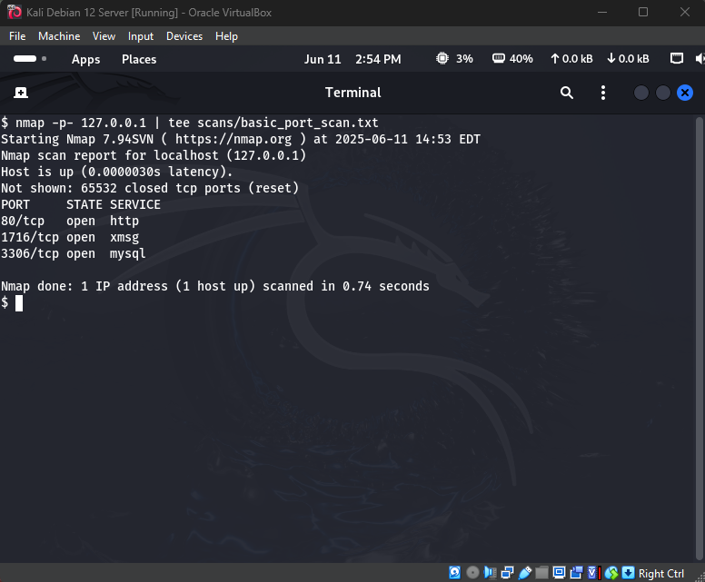
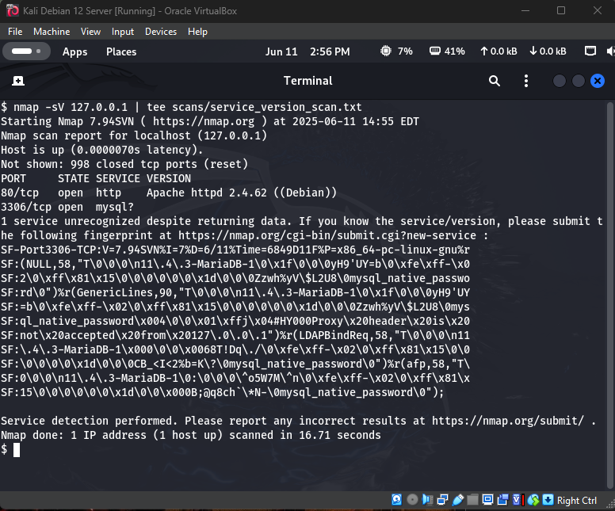
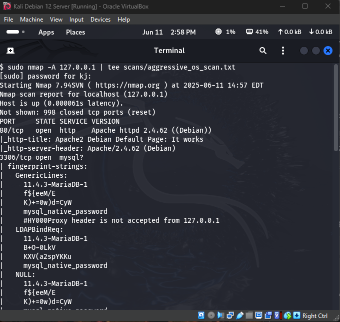

# Nmap Scanning & Enumeration Lab

## 📘 Overview

This project demonstrates several Nmap scanning techniques used for network reconnaissance and service enumeration. All scans were executed inside a Kali Linux virtual machine as part of hands-on cybersecurity lab work.

## 🛠️ Tools Used

- **Kali Linux VM**
- **Nmap v7.94**
- **Localhost (127.0.0.1)**

---

## 🔍 Scan 1: Basic TCP Port Scan

```bash
nmap -p- 127.0.0.1
````

📌 **Purpose**: Scans all 65,535 TCP ports on the target machine to find open ports.

📸 **Screenshot**:


---

## 📦 Scan 2: Service Version Detection

```bash
nmap -sV 127.0.0.1
```

📌 **Purpose**: Identifies running services and their versions on detected open ports.

📸 **Screenshot**:


---

## 🛡️ Scan 3: Aggressive Scan + OS Detection

```bash
sudo nmap -A 127.0.0.1
```

📌 **Purpose**: Performs OS detection, version detection, script scanning, and traceroute for in-depth host info.

📸 **Screenshot**:



---

## 🧠 Summary

These scans simulate the reconnaissance phase of a penetration test. Nmap is a foundational tool in cybersecurity and helps identify open ports, system services, and potential vulnerabilities. Practicing with these scans builds a deeper understanding of how attackers gather initial intelligence — and how defenders can harden their systems.

---

## 👨🏽‍💻 Author

**Kerry “KJ” Jackson II**
🎓 Computer Information Systems Major | Cybersecurity Minor
🔗 [LinkedIn](https://www.linkedin.com/in/kerryjacksonii) | [GitHub](https://github.com/kjacksonn)
